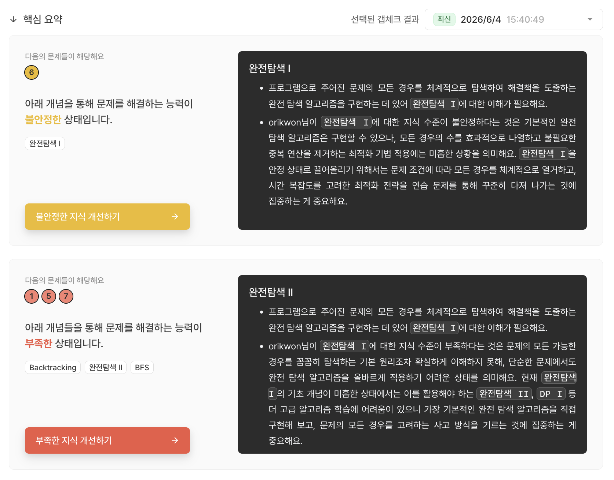

## 들어가며

이제 슬슬 코딩 테스트도 준비해볼까? 라는 생각을 하던 도중 백준이 서비스를 종료하는 대형 사건(?)이 일어났다.

보유하고 있던 PS 강의들도 대부분 백준에 맞춰져 있다 보니, 준비 계획에 다소 차질이 생긴 것이다. 인생은 역시 생각한 대로 흘러가진 않나 보다.

어찌 됐든, 다른 플랫폼을 찾아보다 발견한 게 `코드트리`라는 플랫폼이었다. 간간히 인스타그램 광고에서 몇 번 봤던 기억이 있어서 찾아 들어가 보았다.

레벨 테스트인 갭 체크부터 단계별로 진행할 수 있는 트레일, 각 주제에 따른 간단한 개념 정리까지. PS를 처음 준비하거나, 오랜만에 다시 잡으려니 감이 잘 오지 않는 사람들에게 꽤 매력적인 요소가 많았다.

서론에서 모든 것을 이야기하기엔 다른 항목들이 아쉬워질 테니 본론으로 들어가 보려 한다.

## 현실을 깨닫게 해준 갭체크

코드트리에 처음 로그인을 하면 `갭체크`라는 일종의 레벨 테스트 진행을 권장한다. 간단한 설문이나 2~3문제 정도 풀어보고 적당히 코스를 지정해 줄 거라 생각하고 잠깐 비는 시간에 가벼운 마음으로 시도했다가, 마음이든 테스트 결과든 여러 가지로 와장창 깨졌다.

밑밥(변명)을 조금 깔아보자면, '살짝 소란스러운 환경 + 인터럽트 있었음 + 웹 검색/IDE 없이 텍스트로만 풀었음 + 펜과 노트 없음'이라는 제한적인 환경이라 평소 환경과는 많이 다르긴 했다(...)

문제는 총 7문제가 출제되었고, 난이도 구성이나 문제 개수는 처음 제공된 사용자의 정보(어떤 문제가 어려웠고 최근에 배운 게 무엇인지)와 진행 도중 못 푸는 문제가 발생하면 난이도 조절을 위해 더 풀어보게 만드는 방식으로 결정되는 것으로 보였다. 난이도 자체는 코드트리에서 예측한 내 실력 범위의 고점과 저점 사이에서 출제되었기에 시간만 들이면 충분히 다 풀 수 있는 문제 위주였다.

다만 시간 제한이 걸리는 경우 재빠르게 떠오르지 않는 문제들로 구성되어 있어, 순발력을 요하는 코딩 테스트 준비라는 관점에서 밸런스가 꽤 잘 맞춰졌다고 생각했다.

시간 제한의 경우 대개 4문제당 2시간의 시간을 주고 알아서 배분할 수 있던 기업형 코딩 테스트와 달리, 개별 문제에 따라 시간을 주며 대부분 길어도 12분~18분 내외로 제한이 걸려 있어서 잠깐 '어어?' 하다 보면 다음 문제로 넘어가 버렸다.

이 정도 속도감을 목표로 공부하면 코딩 테스트 준비에 꽤 도움이 될 것 같긴 했다.

  
(부끄럽지만 받아들이자)

문제를 풀고 나면 위의 이미지처럼 애매한 부분, 부족한 부분에 대해서 정리를 해주고, 코드트리에서 제공하는 트레일 중 어디서부터 시작하면 좋을지 제안해 준다.

나의 경우엔 탐색 문제에서 부족하다는 분석이 나왔고, 요즘은 이 분석에 따라 부족한 부분을 채워 넣고 있다. 내 약점이 무엇인지 냉정하게 파악할 수 있다 보니, 무작정 첫 번째 문제부터 풀어나간다거나 관심 있는 개념만 찾아서 연습할 때보다 훨씬 더 큰 동기부여가 되어서 좋았다.

## 맺으며

깔끔하게 결론을 이야기하자면, 찍먹하려고 켰다가 연간 구독 버튼을 찾을 정도로 꽤 마음에 들었다.

코드트리는 이제 막 준비를 시작한 취업 준비생이나, 오랜만에 공부하고 싶은데 어떤 것부터 다시 짚어 나가야 할지 모르는 나 같은 사람에게 상당히 괜찮은 플랫폼이라고 생각한다.

갭체크로 현실적인 상태를 파악하고, 추천 트레일로 실력을 채워 넣고, 카톡 알림(의외로 연속 학습 지속 효과에 도움이 됨)으로 공부 알림을 받으며 조금씩 꾸준히 따라가다 보면 누구나 유의미한 실력 향상을 경험하지 않을까? 라는 생각이 들었다.